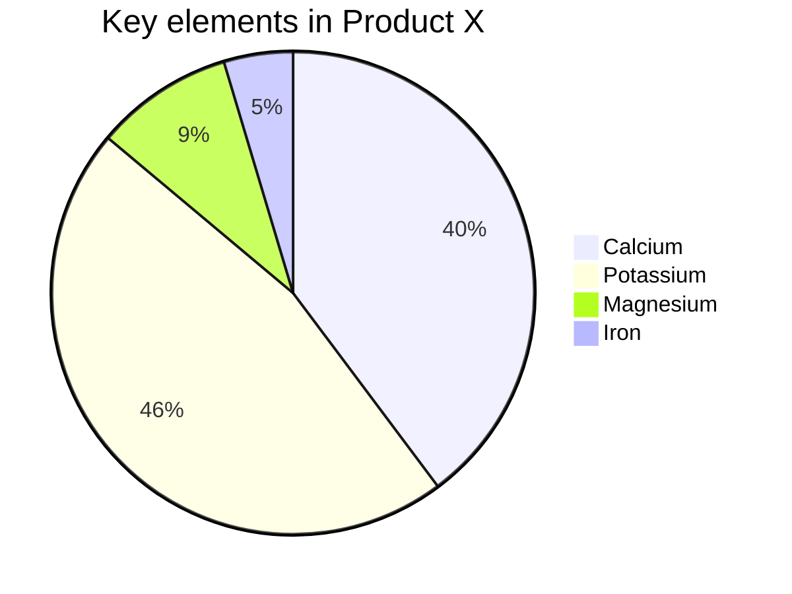

# mermaid
View your mermaid code examples with mermaid.js for Typemill

## How to use 
You can use mermaid in code blocks. Please switch to the raw editor and add the mermaid keyword after the backtipps like this:

## snapshot image

